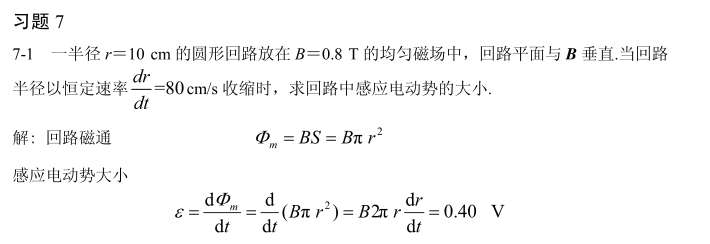
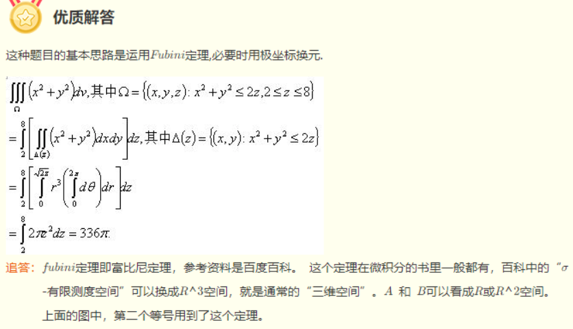

# 基础知识

## 连分数

数x表示为如下形式


可以
$$
x=[a 
0
​
 ,a 
1
​
 ,a 
2
​
 ,a 
3
​
 ,…,a 
n
​
 ]
$$
例子：


```python
        def continuedfra(x,y):
            cf = []
            while y:
                cf += [x//y]
                x,y = y,x%y
            return cf

        n = continuedfra(73,95)
        print(n)
```


## 离散对数

n1=p1q1，则ord(p1)=q1，因为
$$
p1^x mod n 
$$
的值只有q1种结果

## 数论

### 同余


### 欧拉定理


$$
m^{p-1} = 1 mod p (p为素数)
$$

### 欧拉函数


### 欧拉准则

给定非零n，**奇素数p**

n有一个平方根（二次余数）当且仅当
$$
n^{p-1/2} = 1 (mod\ p)
$$
若n没有平方根
$$
n^{p-1/2} = -1 (mod\ p)
$$

可以通过此判断n是否为p的二次剩余

### 欧几里得算法


### 扩展欧几里得


### 中国剩余定理


### 指数循环节


## 抽象代数


# 题目

## [CISCN]puzzle【】

### 题目


### 解法

是真的不能再绝了（ ~~`sos`~~

#### question 0 【方程组】

解方程即可

```python
x = sympy.Symbol('x')
y = sympy.Symbol("y")
z = sympy.Symbol("z")
m = sympy.Symbol("m")

solved_value = sympy.solve([13627*x + 26183*y + 35897*z + 48119*m -347561292 ,
                            23027*x + 38459*y + 40351*z + 19961*m -361760202,
                            36013*x + 45589*y + 17029*z + 27823*m -397301762,
                            43189*x + 12269*y + 21587*z + 33721*m -350830412], [x,y,z,m])
print(solved_value)

```

得到{x: 4006, y: 3053, z: 2503, m: 2560}

fa6bed9c7a00

#### question 1【找规律】

刚开始还以为会有等差数列什么的（

但是发现不对，再发现好像都是素数（ctf 密码也经常接触素数，应该就是相邻的素数

26365399 (0x1924dd7)

#### question 2【极限、积分】

```python
# 极限
x = sympy.Symbol('x')
f = (x**2 -3*x + 2)/(x**2-4)
print(sympy.limit(f,x,2))

# 积分
f = sympy.exp(x)*(4+sympy.exp(x))**2
print(sympy.integrate(f,(x,0,sympy.ln(2))))

f2 = (1 + 5*sympy.ln(x))/x
print(sympy.integrate(f2,(x,1,sympy.exp(1))))

f3 = x*sympy.sin(x)
print(sympy.integrate(f3,(x,0,sympy.pi/2)))
```


#### question 3【电磁感应】



18640 (0x48d0)

#### question 4【fubini定理】


https://www.zybang.com/question/aed760f3251be1a87a2ab0d2069eb295.htmlhttps://www.zybang.com/question/aed760f3251be1a87a2ab0d2069eb295.html

40320 (0x9d80)
