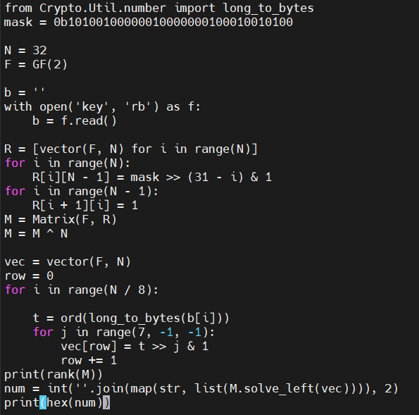

## [watevrCTF 2019]Crypto over the intrawebs【z3-solver】

### 题目

两个client，一个server文件，一个通信记录

```python

import socket, select, signal, string
import sys, os, time, random
import threading

HOST = '198.51.100.0'
PORT = 1337
USERNAME = "Houdini"

s = socket.socket(socket.AF_INET, socket.SOCK_STREAM)
s.connect((socket.gethostname(), PORT))
key = int(s.recv(1240).decode("utf-8").split(" ")[1])

def encrypt(plaintext):
	global USERNAME
	global key
	plaintext = USERNAME + ": " + plaintext
	out = [random.randint(0, 9999), random.randint(0, 999)]
	for i in range(len(plaintext)):
		out.append((out[i+1] + ((out[i] * ord(plaintext[i])) ^ (key+out[i+1]))) ^ (key*out[i]))

```

### 解法

已知量：out（conversation中的通信记录）

未知量：key（密钥，需要求解）

目标：plaintext，即得到key，解密conversation中的通信内容

根据`KEY = random.randint(0, 100000000000000000000000)`可知key的位数大概为77位

根据`plaintext = USERNAME + ": " + plaintext`

而USERNAME是知道的，比如 USERNAME = "Houdini:" 包括冒号共知道10个字符，且知道加密代码：

> ((out[i + 1] + ((out[i] * ord(plain[i])) ^ (key + out[i + 1]))) ^ (key * out[i]))==out[i+2]

就可以得到10个方程，用z3求解

不同的位数都可能求出key值，爆破这些key来找到可用于解密的key

```python
def z3key(out,plain):
    #out.append((out[i+1] + ((out[i] * ord(plaintext[i])) ^ (key+out[i+1]))) ^ (key*out[i]))
    for count in range(2,78):
        key=BitVec('key',count)
        s=Solver()
        for i in range(8):
            s.add(((out[i + 1] + ((out[i] * ord(plain[i])) ^ (key + out[i + 1]))) ^ (key * out[i]))==out[i+2])
        s.check()
        res=s.model()
        print(res)
        res = res[key].as_long().real
        print(res)
        f=open('conversation','r').readlines()
        x=[]
        for j in f:
            x.append(j.strip())
        flag=''
        for j in range(1,len(x),2):
            li=x[j].split(' ')
            for k in range(1,len(li)):
                li[k]=eval(li[k])
            for k in range(1,len(li)-2):
                try:
                    flag += chr(((res + li[k + 1]) ^ (((res * li[k]) ^ li[k + 2]) - li[k + 1])) // li[k])
                except:
                    break
        if 'watevr{' in flag:
            print(flag)
            break
out=[8886, 42, 212351850074573251730471044, 424970871445403036476084342 ,5074088654060645719700112791577634658478525829848, 17980375751459479892183878405763572663247662296, 121243943296116422476619559571200060016769222670118557978266602062366168 ,242789433733772377162253757058605232140494788666115363337105327522154016 ,2897090450760618154631253497246288923325478215090551806927512438699802516318766105962219562904, 7372806106688864629183362019405317958359908549913588813279832042020854419620109770781392560]  #随便选一组即可
plain='Houdini:'
```


# Xor


## ？[SUCTF2019]MT【移位】

https://blog.csdn.net/m0_49109277/article/details/117324488


## [GKCTF 2021]Random【MT19937】

### 题目

代码和生成的随机数的文件random.txt

```python
import random
from hashlib import md5

def get_mask():
    file = open("random.txt","w")
    for i in range(104):
        file.write(str(random.getrandbits(32))+"\n")
        file.write(str(random.getrandbits(64))+"\n")
        file.write(str(random.getrandbits(96))+"\n")
    file.close()
get_mask()
flag = md5(str(random.getrandbits(32)).encode()).hexdigest()
print(flag)

```

生成104组随机数后，生成一个随机数并MD5后

### 思路

通过random.getrandbits(N)生成随机数：返回具有 k 个随机比特位的非负 Python 整数。 此方法随 MersenneTwister 生成器一起提供，其他一些生成器也可能将其作为 API 的可选部分提供。 在可能的情况下，getrandbits() 会启用 randrange() 来处理任意大的区间。


MT19937能生成 1≤k≤623 个32位均匀分布的随机数。而正巧我们已经有（104 + 104 ∗ ( 64 / 32 ) + 104 ∗ ( 96 / 32 ) = 624 个生成的随机数了，也就是说，根据已经有的随机数我们完全可以推出下面会生成的随机数。


可以用randcrack库，其根据前624个32位数字，获得Mersenne Twister矩阵的最可能状态，即内部状态，然后预测后面生成的随机数。


**根据代码，可以发现一行一个32位，一行2个32位数，一行3个32位数，所以我们也需要进行相应处理，再进行submit才能准确得到内部状态。**


```python
from hashlib import md5
from randcrack import RandCrack
def foo(l,i):
    a=[]
    a.append(l[i])
    b1=l[i+1]>>32
    b2=l[i+1]&(2**32-1)
    a.append(b2)
    a.append(b1)
    b1=l[i+2]>>64
    b2=(l[i+2]&(2**64-1))>>32
    b3=l[i+2]&(2**32-1)
    a.append(b3)
    a.append(b2)
    a.append(b1)
    return a

def mt19937(filename):
    with open(filename,'r') as f:
        l=f.readlines()
    l=[int(i.strip()) for i in l]
    ll=[]
    for i in range(0,len(l),3):
        ll+=foo(l,i)
    rc=RandCrack()
    for i in ll:
        rc.submit(i)
    aa=rc.predict_getrandbits(32)
    print(md5(str(aa).encode()).hexdigest())
```


# LFSR

## [AFCTF2018]tinylfsr

根据给出的文件，发现两次文件加密

- plain->cipher
- flag->flag_encode

查看encrypt.py，加密方式为

- 前一部分：key与plain的前一部分xor
- 后一部分：lfsr生成的密钥流与plain的后一部分xor

进一步分析，可以发现key与mask位数是相同的，看了一下mask的位数是二进制64位，那么key的位数就是16进制16位，也就是8位ASCII字符.

(不知道key长度的话，也可以遍历一下，再用该key对plain加密看是否与cipher相同)

```python
cip = open('cipher.txt', 'rb').read()
msg = open('Plain.txt', 'rb').read()

print(codecs.encode(strxor(cip, msg)[:8], 'hex'))
```

接下来可以生成lfsr的密钥流，再依次解密（R要初始化为key）

```python
key = '0123456789abcdef'
R = int(key, 16)
mask = 0b1101100000000000000000000000000000000000000000000000000000000000


def lfsr(R, mask):
    # 左移1位：保留末尾 63 位，在最后添加一个0
    output = (R << 1) & 0xffffffffffffffff

    # i：保留 R 的前 0、1、3、4位
    i = (R & mask) & 0xffffffffffffffff

    lastbit = 0
    while i != 0:
        lastbit ^= (i & 1)
        i = i >> 1
    # lastbit：统计 i 里面有多少个1, 奇数个则为1, 偶数个则为0

    # output: R 左移1位，再添加 lastbit
    output ^= lastbit
    return (output, lastbit)


cip = open('flag_encode.txt', 'rb').read()
a = ''.join([chr(int(b, 16)) for b in [key[i:i + 2] for i in range(0, len(key), 2)]])

ans = ""

for i in range(len(a)):
    ans += (chr((cip[i] ^ ord(a[i]))))

lent = len(cip)

for i in range(len(a), lent):
    tmp = 0
    for j in range(8):
        (R, out) = lfsr(R, mask)
        tmp = (tmp << 1) ^ out
    ans += (chr(tmp ^ cip[i]))

print(ans)

```


## [CISCN2018]oldstreamgame【output+F->初始状态】

### 题目

steam.py 和 key

```python
flag = "flag{xxxxxxxxxxxxxxxx}"
assert flag.startswith("flag{")
assert flag.endswith("}")
assert len(flag)==14

def lfsr(R,mask):
    output = (R << 1) & 0xffffffff
    i=(R&mask)&0xffffffff
    lastbit=0
    while i!=0:
        lastbit^=(i&1)
        i=i>>1
    output^=lastbit
    return (output,lastbit)

R=int(flag[5:-1],16)
mask = 0b10100100000010000000100010010100

f=open("key","w")
for i in range(100):
    tmp=0
    for j in range(8):
        (R,out)=lfsr(R,mask)
        tmp=(tmp << 1)^out
    f.write(chr(tmp))
f.close()
```


### 解法

已知输出序列和反馈函数，求初始状态

https://ctf-wiki.org/crypto/streamcipher/fsr/lfsr/#2018-ciscn-oldstreamgame


？！矩阵感觉不太明白

https://www.cnblogs.com/Mr-small/p/14125439.html



## [CISCN]lfsr【output->mask,BM】

### 题目

```python
import random

from secret import flag

N = 100
MASK = 2**(N+1) - 1

def lfsr(state, mask):
    feedback = state & mask
    feed_bit = bin(feedback)[2:].count("1") & 1
    output_bit = state & 1
    state = (state >> 1) | (feed_bit << (N-1))
    return state, output_bit

def main():
    assert flag.startswith("flag{")
    assert flag.endswith("}")

    mask = int(flag[5:-1])
    assert mask.bit_length() == N
    
    state  = random.randint(0, MASK)
    print(state)
    
    outputs = ''
    for _ in range(N**2):
        state, output_bit = lfsr(state, mask)
        outputs += str(output_bit)
    
    with open("output.txt", "w") as f:
        f.write(outputs)

main()
```

### 解法

LFSR，只知道10000个bit的output，不知道初始状态和掩码，flag主要与掩码有关。

由于LFSR的性质，每次生成的bit都会加到向量的最低位，同时丢弃最高位，因此在连续100次生成后，原有的state的所有位都被丢弃，lfsr的状态会转化为已知的100个bit——即output的前100位。之后，完全知道lfsr的状态，只需要在已知状态的情况下推出mask。

每连续100个bit可以生成下一个bit，我们知道这100个bit，也知道下一个bit，但不知道mask，也就是说需要在 GF(2) 上，100位的已知的状态向量，点乘上 100位的掩码向量，得到的数已知。现在求掩码向量。

上面是一个方程；而状态向量有 100维，我们需要 100组方程才能解出整个掩码向量解。由于在有限域GF(2)内，只有0和1，此时乘法相当于异或，加法相当于与运算。
因此可直接将公式中的异或（⊕）替换为乘法（*），将与运算（&）替换为加法（+），即可得到线性方程组：
$$
state[101] =  mask[100]*state[100] + mask[99]*state[99] + ... + mask[1]*state[1]
\\ state[102] =  mask[101]*state[101] + mask[100]*state[100]+...+mask[1]*state[2]
\\...
\\sate[200] = mask[100]*state[199] + mask[99]*state[198]+...+mask[1]*state[100]
$$
方程组的问题可以转化为矩阵求逆的问题。把 lfsr 的状态一行一行地写在矩阵上，形成的矩阵记为 M. 把 lsfr 每次所生成的结果也拼成一个向量，记为 T. 

那么掩码向量 v 使得：
$$
M⋅v=T
$$
于是两边左乘M的逆矩阵，可以得到掩码向量：
$$
v = M^{-1}·T
$$


```python
def BM(output,length):
    with open(output,'r') as f:
        out = f.read()
        s = [int(x) for x in out]
        print(len(s))
    list2 = []
    for i in range(length):
        list2.append(int(j) for j in list(reversed(out[i:i+length])))

    M = matrix(GF(2),list2)
    T = vector(GF(2),length)


    for i in range(length):
        T[i] = s[i + length ]

    try:
        mask =  M.inverse() * T
        print((int(''.join(map(str, (mask))), base=2)))
        return mask
    except:
        return

```

https://www.codeleading.com/article/58654807383/


## [De1CTF2019]Babylfsr

### 题目

task.py 与output文件

KEY，FLAG，MASK均未知

但已知flag[7:11]为1224，开头为de1ctf

KEY和MASK长度均为256

填充方式为不足八位的在前面加0


### 解法

根据BM算法，至少需要知道2*MASK.bitlength（即2 * 256 =512位）长的输出序列，才可以推测出初始seed

而题目给出的输出序列只有504位，所以未知的8个二进制位可以通过爆破得到，然后根据flag[7:11]为1224筛选得到

```python
# key为输出序列前n（mask.bitlength)位,已知输出序列和mask，逆推求seed
def get_key(mask,key):
    R = ""
    index = 0
    key = key[255] + key[:256]
    while index < 256:
        tmp = 0
        for i in range(256):
            if mask >> i & 1:
                # tmp ^= int(key[255 - i])
                tmp = (tmp+int(key[255-i]))%2
        R = str(tmp) + R
        index += 1
        key = key[255] + str(tmp) + key[1:255]
    return int(R,2)

# 将二进制流转化为十进制
def get_int(x):
    m=''
    for i in range(256):
        m += str(x[i])
    return (int(m,2))

# 输出序列output不够2n长度，爆破后面几位
import hashlib
import itertools


# 输出序列r
r = '001010010111101000001101101111010000001111011001101111011000100001100011111000010001100101110110011000001100111010111110000000111011000110111110001110111000010100110010011111100011010111101101101001110000010111011110010110010011101101010010100101011111011001111010000000001011000011000100000101111010001100000011010011010111001010010101101000110011001110111010000011010101111011110100011110011010000001100100101000010110100100100011001000101010001100000010000100111001110110101000000101011100000001100010'
def pad(sz):
    rr = [int(i) for i in r] + sz
    M = matrix(GF(2),256,256)
    X = vector(GF(2),256)
    for i in range(256):
        M[i] = rr[i:i+256]
        X[i] = rr[i+256]
    try:
        m = M.inverse()*X
        seed = get_key(get_int(m),r[:256])
        seed = hex(seed)[2:]
        sha = hashlib.sha256(seed.encode()).hexdigest()
        if sha[:4] == '1224':
            print('de1ctf{' + sha + '}')
            exit()
    except:
        return

for i in itertools.product([0,1],repeat = 8):
    pad(list(i))

```


