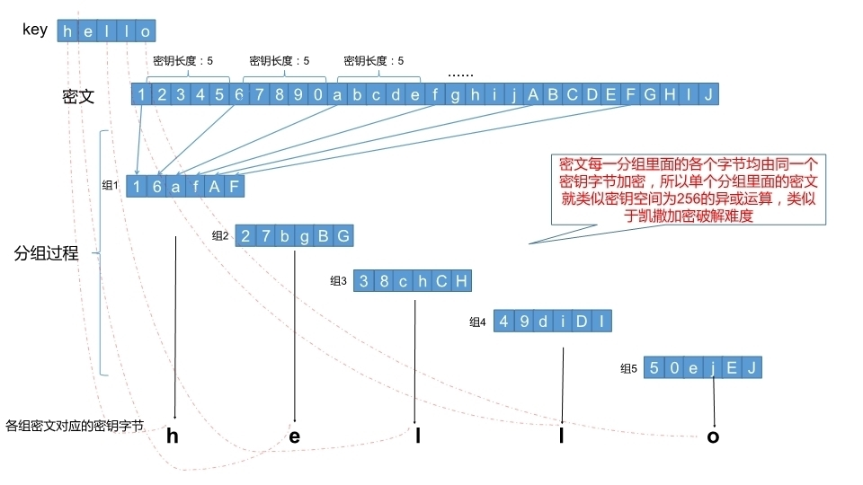
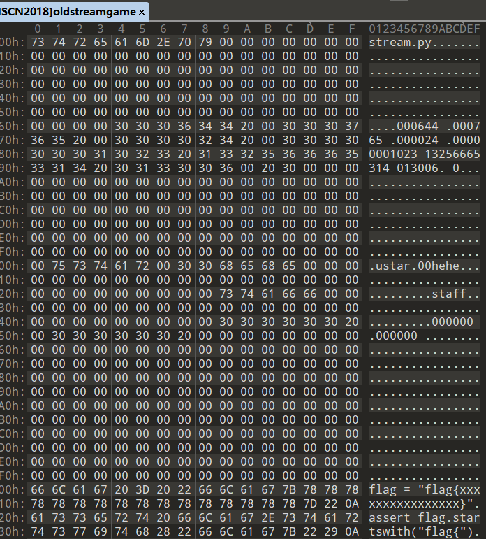

# 流密码

## ?[AFCTF2018]你听过一次一密么？

一次一密（One-Time-Pad）：xor key  明文多长，密文就多长（适合少量明文消息）

Many-Time-Pad攻击：多个明文异或同样的key

https://www.ruanx.net/many-time-pad/

攻击思想：对于每一条密文Ci，拿去异或其他所有密文。然后去数每一列有多少个英文字符，作为“Mi在这一位是空格”的评分。依据评分从大到小排序，依次利用 “某个明文的某一位是空格” 这种信息恢复出所有明文的那一列。如果产生冲突，则舍弃掉评分小的


**修复语句太绝了**


## ？[De1CTF2019]xorz 【频率分析/break repeating-key】

**法一：流密码**

参考

https://www.anquanke.com/post/id/161171#h3-

http://socold.cn/index.php/archives/65/

### 一.猜测密钥长度

1.暴力破解：

https://www.ruanx.net/many-time-pad/

给的是 m[i]⊕k[i]⊕s[i], 其中 s 已知，故实际上我们拿到了 m[i]⊕k[i]. 在这里 k 是有周期的，且周期不超过38。如果知道了 k 的周期，那么用 Many-Time-Pad 就可以成功攻击。由于 `len(key)` 并不大，从大到小枚举 `len(key)`，肉眼判断是否为flag即可。最后发现 `len(key)=30` 是满足要求的。

但是这种方法过于耗时费力

2.汉明距离：一组二进制数据变成另一组数据所需的步骤数。对两组二进制数据进行异或运算，并统计结果为1的个数，那么这个数就是汉明距离。

- 根据扩展资料：

  - 两个以ascii编码的英文字符的汉明距离是2-3之间，也就是说正常英文字母的平均汉明距离为2-3（每比特），任意字符（非纯字母）的两两汉明距离平均为4。

  - 正确分组的密文与密文的汉明距离等于明文与明文的汉明距离（可以通过按正确密钥长度分组的密文与密文异或等于明文与明文异或证明）

    因此，当我们使用了正确的密钥长度后，两两字母进行计算汉明距离，那么这个值应该是趋于最小。为了增加效率，我们不需要对每一对分组都计算汉明距离，只需取出前几对就可说明问题。当然为了排除偶然误差，结果不应该只取最小的那一个密钥长度，而是酌情多取几组


### 二.根据猜出的密文长度进行解密

两种方法：

- 合理利用明文的空格

  在使用异或加密的形式下，使用相同密钥加密的明文和秘文间存在这个规律，密文和密文异或等于明文和明文异或,并且二者的汉明距离一样。

  空格和所有小写字母异或结果是相应的大写字母，空格和所有大写字母异或是相应的小写字母。

  

  

 	1. 使用取模运算把密文分成n个分组（其中n是密钥长度），如此以来，我们就有了n个独立的凯撒加密式的密文组（因为每个分组里面的值是使用同一个密钥字节明文异或）。这样就把问题简化成了破解n个独立的凯撒加密模式的单字节抑或密码方式。这一步可以直接使用爆破，但是效率不高。我们采取另一种姿势。 
 	2. 将2中的每个分组做如下的操作：每个分组做嵌套循环，内循环，外循环。设置外循环计数值possible*_space=0，max_*possible=0，设置内循环计数值maxpossible=0,依次取出每个分组中的每一个字节做与其他字节两两抑或进行内循环，如果结果是字母，我们就把内循环计数值maxpossible+1,在每个内循环结束后进行max*_possible的更新（与内循环maxpossible做对比），并记录当前字节的位置到possible_*space，然后外循环继续。直至遍历完所有的字节。取出max*_possible对应的字节位置possible_*space处的字节码，我们把它对应的明文假设成空格（根据之前的讨论）然后将该位置的字节和0x20（空格）异或;找出相应位置的密钥字节。 

3. 重复2中的步骤，依次根据每个分组找出每位的密钥字节，至此密钥破解完毕 

4. 将找出的密钥用于破解密文。当密文足够多，可以发现破解的准确率很高，基本可以做到无差别破解。


**词频分析**

https://codeleading.com/article/68135872581/


## ？[SUCTF2019]MT【移位】

https://blog.csdn.net/m0_49109277/article/details/117324488


## [GKCTF 2021]Random【MT19937】

### 题目

代码和生成的随机数的文件random.txt

```python
import random
from hashlib import md5

def get_mask():
    file = open("random.txt","w")
    for i in range(104):
        file.write(str(random.getrandbits(32))+"\n")
        file.write(str(random.getrandbits(64))+"\n")
        file.write(str(random.getrandbits(96))+"\n")
    file.close()
get_mask()
flag = md5(str(random.getrandbits(32)).encode()).hexdigest()
print(flag)

```

生成104组随机数后，生成一个随机数并MD5后

### 思路

通过random.getrandbits(N)生成随机数：返回具有 k 个随机比特位的非负 Python 整数。 此方法随 MersenneTwister 生成器一起提供，其他一些生成器也可能将其作为 API 的可选部分提供。 在可能的情况下，getrandbits() 会启用 randrange() 来处理任意大的区间。


MT19937能生成 1≤k≤623 个32位均匀分布的随机数。而正巧我们已经有（104 + 104 ∗ ( 64 / 32 ) + 104 ∗ ( 96 / 32 ) = 624 个生成的随机数了，也就是说，根据已经有的随机数我们完全可以推出下面会生成的随机数。


可以用randcrack库，其根据前624个32位数字，获得Mersenne Twister矩阵的最可能状态，即内部状态，然后预测后面生成的随机数。


**根据代码，可以发现一行一个32位，一行2个32位数，一行3个32位数，所以我们也需要进行相应处理，再进行submit才能准确得到内部状态。**


```python
from hashlib import md5
from randcrack import RandCrack
def foo(l,i):
    a=[]
    a.append(l[i])
    b1=l[i+1]>>32
    b2=l[i+1]&(2**32-1)
    a.append(b2)
    a.append(b1)
    b1=l[i+2]>>64
    b2=(l[i+2]&(2**64-1))>>32
    b3=l[i+2]&(2**32-1)
    a.append(b3)
    a.append(b2)
    a.append(b1)
    return a

def mt19937(filename):
    with open(filename,'r') as f:
        l=f.readlines()
    l=[int(i.strip()) for i in l]
    ll=[]
    for i in range(0,len(l),3):
        ll+=foo(l,i)
    rc=RandCrack()
    for i in ll:
        rc.submit(i)
    aa=rc.predict_getrandbits(32)
    print(md5(str(aa).encode()).hexdigest())
```


## [AFCTF2018]tinylfsr

根据给出的文件，发现两次文件加密

- plain->cipher
- flag->flag_encode

查看encrypt.py，加密方式为

- 前一部分：key与plain的前一部分xor
- 后一部分：lfsr生成的密钥流与plain的后一部分xor

进一步分析，可以发现key与mask位数是相同的，看了一下mask的位数是二进制64位，那么key的位数就是16进制16位，也就是8位ASCII字符.

(不知道key长度的话，也可以遍历一下，再用该key对plain加密看是否与cipher相同)

```python
cip = open('cipher.txt', 'rb').read()
msg = open('Plain.txt', 'rb').read()

print(codecs.encode(strxor(cip, msg)[:8], 'hex'))
```

接下来可以生成lfsr的密钥流，再依次解密（R要初始化为key）

```python
key = '0123456789abcdef'
R = int(key, 16)
mask = 0b1101100000000000000000000000000000000000000000000000000000000000


def lfsr(R, mask):
    # 左移1位：保留末尾 63 位，在最后添加一个0
    output = (R << 1) & 0xffffffffffffffff

    # i：保留 R 的前 0、1、3、4位
    i = (R & mask) & 0xffffffffffffffff

    lastbit = 0
    while i != 0:
        lastbit ^= (i & 1)
        i = i >> 1
    # lastbit：统计 i 里面有多少个1, 奇数个则为1, 偶数个则为0

    # output: R 左移1位，再添加 lastbit
    output ^= lastbit
    return (output, lastbit)


cip = open('flag_encode.txt', 'rb').read()
a = ''.join([chr(int(b, 16)) for b in [key[i:i + 2] for i in range(0, len(key), 2)]])

ans = ""

for i in range(len(a)):
    ans += (chr((cip[i] ^ ord(a[i]))))

lent = len(cip)

for i in range(len(a), lent):
    tmp = 0
    for j in range(8):
        (R, out) = lfsr(R, mask)
        tmp = (tmp << 1) ^ out
    ans += (chr(tmp ^ cip[i]))

print(ans)

```


## [CISCN2018]oldstreamgame【】

### 题目

010editor打开发现stream.py和key



### 解法

R未知，
